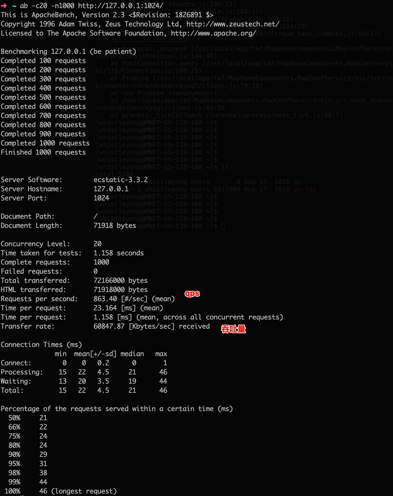
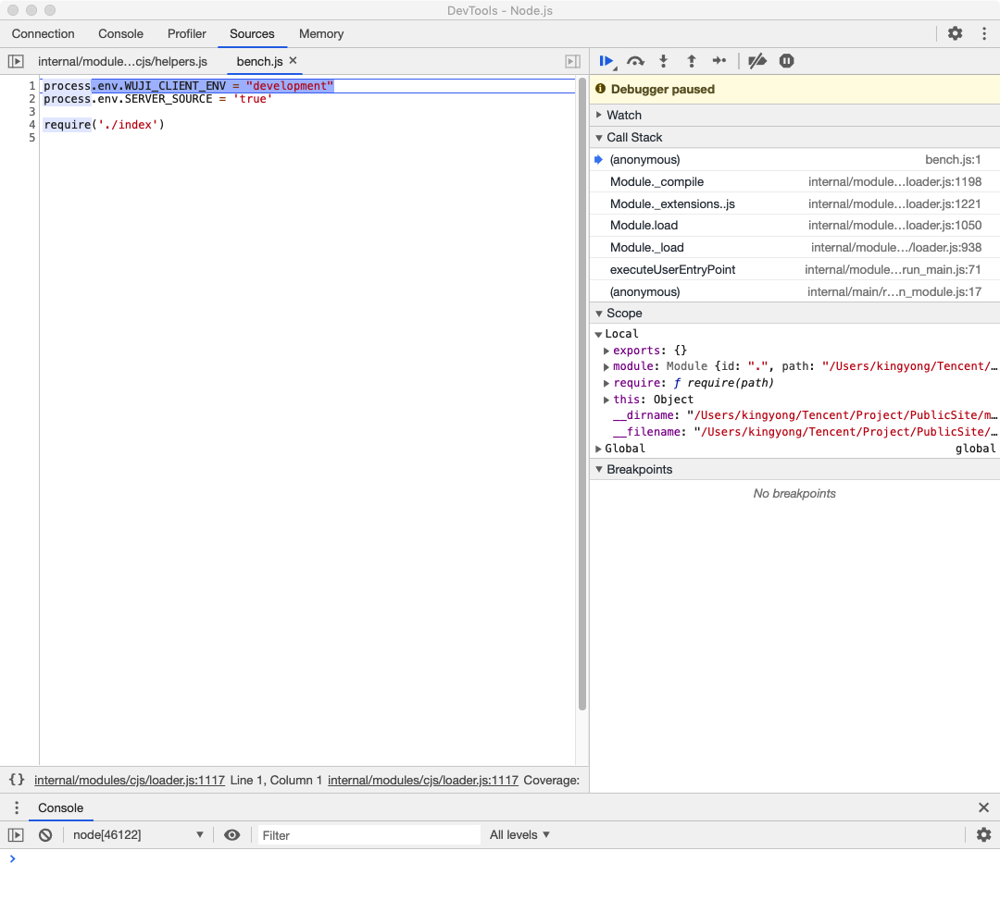
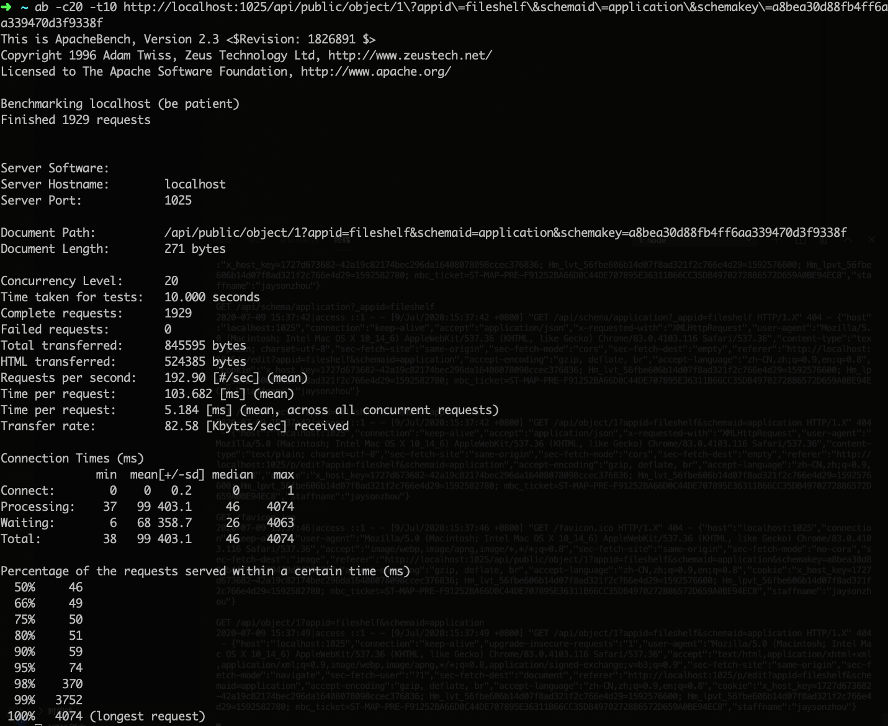
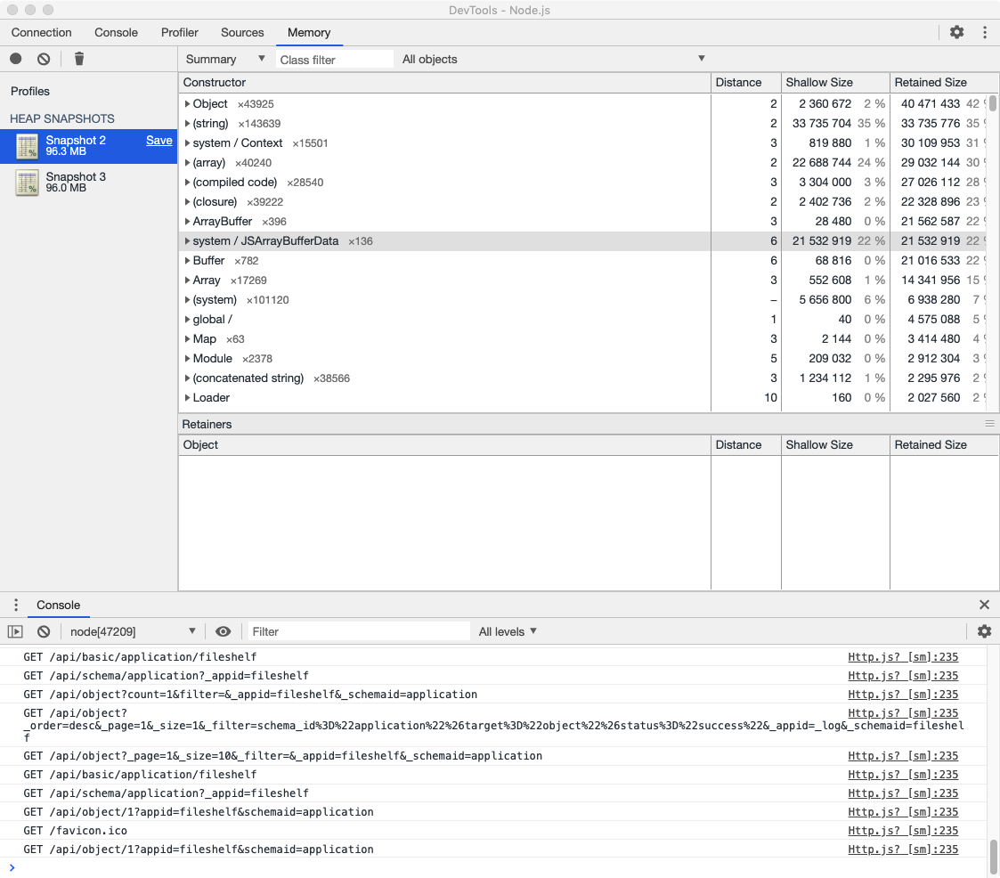

# nodejs压力测试

## 快速上手

### 1.1 安装 apr pcre

```shell
brew install apr
brew install pcre

brew info apr
# 加载提示中的环境变量
echo 'export PATH="/usr/local/opt/apr/bin:$PATH"' >> ~/.zshrc
echo 'export PATH="/usr/local/opt/apr-util/bin:$PATH"' >> ~/.zshrc
source ~/.zshrc
```

### 1.2 安装 httpd

http://httpd.apache.org/download.cgi#apache24


解压后从命令行中进入：

```shell
./configure
make
sudo make install
```

等待安装成功之后，在命令行中能正常输出 ab 版本表示安装成功：

```shell
ab -V
# This is ApacheBench, Version 2.3 <$Revision: 1826891 $>
# Copyright 1996 Adam Twiss, Zeus Technology Ltd, http://www.zeustech.net/
# Licensed to The Apache Software Foundation, http://www.apache.org/
```

### 1.3 使用

假如现在有个监听在本地 1024 端口的服务，你可以使用两种方式来进行压力测试

1. 使用 ab 模拟 20 个客户端发出 1000 次请求：

```shell
ab -c20 -n1000 http://127.0.0.1:1024
```

2. 使用 ab 模拟 20 个客户端连续发出请求15s：

```shell
ab -c20 -t15 http://127.0.0.1:1024
```

参数说明:

| 参数   | 说明                   |
| ------ | ---------------------- |
| -c20   | 模拟20个客户端并发请求 |
| -n1000 | 总共发起1000次请求     |
| -t15   | 请求15秒               |

结果示例：



### 1.4 术语

在测试结果中，我们一般关系这几个概念：

1. Request per second （qps）

指的是一个并发用户单位时间内的请求数。也就是结果中的 Complete requests / Time taken form tests ，即 1000 / 1.158 = 863

2. Transfer rate 

平均每秒网络上的流量，可以用来和机器的网卡或者硬盘来对比，看看网络数据传输是否达到了最大性能

## 压测 nodejs

### 启动服务

1. 以调试的方式启动 nodejs 程序

```shell
node --inspect-brk ./index.js
```

2. 打开 chrome inspect 工具

在地址栏里输入：`chrome://inspect`


然后就可以得到一个 chrome 的调试工具，可以像调试前端应用一样调试nodejs程序:




### 内存快照

跳过 debugger 对我们的本地服务进行压力测试，这里我想看一下 /api/public/object 接口是否有性能问题：

```shell
ab -c20 -t10 http://localhost:1025/api/public/object/1\?appid\=fileshelf\&schemaid\=application\&schemakey\=a8bea30d88fb4ff6aa339470d3f9338f
```

1. 测试结果



2. 内存快照




