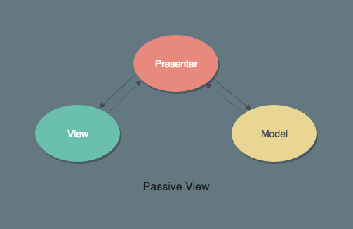

> 维基百科：通常来说，程序员每修改一次程序就会进行最少一次单元测试，在编写程序的过程中前后很可能要进行多次单元测试，以证实程序达到软件规格书要求的工作目标，没有程序错误....... 

其实看到这句话，我是懵逼的。不知道大家什么情况，在我所经历的前端项目中，基本没有什么单元测试，大多情况下也就那么一说，像是在坚守程序员的底线一样。

单元测试毕竟有存在的意义，很多人不理解，微信小程序的开发文档中甚至都没怎么提及单元测试。这些人也不会理解测试人员存在的意义，测试软件的可用性是基本操作，而更重要的是保证软件的健壮性、甚至促进研发成长，比如通过推动单元测试、持续集成等手段。

收...

既然单元测试很有意义，那么我们如何来对小程序进行单元测试呢？

## 前提

首先说明的是，我们仅对代码逻辑作是做单元测试，而不进行 UI 自动化测试。

### MVC 的架构

假设你的项目有一定的复杂度，需要接入单元测试，尽管小程序作为 MVVM 框架，但是作为 GUI 编程，一个 MVC 的架构是非常必要的，至少你的业务逻辑大部分应该抽离到类似于 MVC 的 `Controller` 中。

比如我们的小程序采用 MVP 架构：



> [浅谈 MVC、MVP 和 MVVM 架构模式](https://draveness.me/mvx)

presenter 类似于 MVC 中的 controller，代码逻辑都放在这里，所以我们就只需要对 presenter 进行单元测试即可

### 模拟小程序的接口

小程序大量的接口都挂载在全局变量 `wx` 下，比如我们在 nodejs 中跑逻辑的话，不可避免的要模拟这些 api。

## 搭建

### 安装测试工具

**安装单元测试框架mocha**

```
npm i -D mocha
```

添加 mocha 配置文件：mocha.opts

```
tests/**/*.test.js
--require @babel/register
--reporter=list
```

执行命令：

```shell
mocha -w --opts ./mocha.opts
```

-w, --watch 监听文件改变自动执行，更多使用方法见[官网](https://mochajs.org/)

**安装断言库 chai**

```shell
npm i -D chai
```

### 模拟小程序环境

这里需要用到小程序的开源工具 [miniprogram-simulate](https://github.com/wechat-miniprogram/miniprogram-simulate) 模拟大部分的 wxapi

```
npm i -D miniprogram-simulate
```

> 注：miniprogram-simulate 仅仅是 mock 了函数，并不是真正实现，比如：wx.request 只是返回了 ok，而并没有真正发起请求

**模拟 dom 环境**

这个工具比较坑的一点是在 mock 部分存储函数的时候：


直接使用了 localStorage 来代替，显然 nodejs 环境下没有这些东西，需要在 nodejs 中模拟 dom 环境：

```
npm i -D jsdom jsdom-global
```

### 使用 babel 转译代码

nodejs 并不支持 import 语法，以及部分比较新的 es6+ 语法。

```shell
npm i -D @babel/core @babel/register
```

在执行 mocha 命令的时候加上 `--require @babel/register`
可以在根目录下添加 `.babelrc` 文件自定义配置

### 导出测试覆盖率

**安装工具 nyc**

```shell
npm i -D nyc
```

查看覆盖率：

`nyc mocha --opts ./mocha.opts`

导出覆盖率 html 文件到 ./coverage 文件夹：

`nyc --reporter=html --report-dir ./coverage --reporter=text mocha --opts ./mocha.opts`

## 示例

```js
// adapter
import 'miniprogram-simulate'
import querystring from 'querystring'
import request from 'request'

require('jsdom-global')(undefined, {
  storageQuota: 10000000,
  url: 'http://localhost:80'
})

// 修正全局 localStorage
global.localStorage = window.localStorage

// 模拟 request
wx.request = function (obj) {
  if (obj.method === 'GET') {
    obj.url += '?' + querystring.stringify(obj.data)
  }
  request(obj, (err, res, body) => {
    if (err) {
      obj.fail(err)
    } else {
      obj.success({ data: JSON.parse(body) })
    }
  })
}
```

编写单元测试代码：

```js
import './adapter'
import { expect, assert } from 'chai'

import { DrivingRoutePlanEntity } from '../plugin/entitys/DrivingRoutePlanEntity'

describe('Model: DrivingRoutePlan', () => {
  const queryOptions = {"from":"39.984210069444444,116.30732204861111","to":"39.957849,116.291090"}
  const model = new DrivingRoutePlanModel()
  
  // describe 的第二个参数不能为异步函数
  it('should request success', async () => {
    const result = await model.driving(queryOptions)

    expect(result).to.be.an('array')
    result.forEach(item => expect(item).to.be.an.instanceof(DrivingRoutePlanEntity))
  })
})
```

命令示例：

```
"scripts": {
    "test": "mocha -w --opts ./mocha.opts",
    "coverage": "nyc mocha --opts ./mocha.opts",
    "coverage:html": "nyc --reporter=html --report-dir ./coverage --reporter=text mocha --opts ./mocha.opts"
  },
```


# End

祝大家搬砖愉快...
