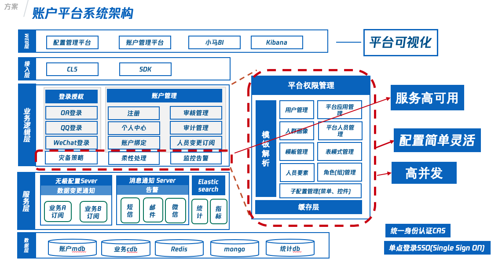

## 技术视野

### 纵向

ES5 - NEXT

Vue、React

### 横向

工程化

MVP 设计思想

## 项目

###账号权限平台

#### 概述

现实挑战：大量的管理平台支持地图的日常业务，权限多头管理，容易出现管理漏洞；用户信息变动频繁
统一管理平台项目权限，赋予权限从 认证、授予、追溯、回收完整生命周期

#### 技术

权限路由：处理用户权限与前端路由的复杂关系
动态表单：支持动态创建表单的能力
形成统一的中后台项目解决方案，应用与内部多个管理平台

#### 延伸

OAUTH 2.0

### 室内小程序

#### 概述

基于微信小程序开发的室内外一体化导航服务

#### 技术方案

MVP：解决业务逻辑复用，解耦视图与模型层关系
AOP：拦截器解决上报、鉴权等问题
数据一体化：数据实体

## 项目自研

### 下载中心

### CDN SDK

## 自我介绍

面试官您好，我叫雍振，是腾讯地图部门的前端工程师。在腾讯里面 Vue 相关的项目做的比较多，所以对 vue 相关的原理比较熟悉，了解nodejs。目前，内部组织架构调整，现在处于动荡期，所以想看看外面的机会。

## 开放性

### 工作中最常遇到的问题

1. 接手、维护老旧代码

- 确保能够跑起来
- 收集所有能收集的文章
- 通过一个新需求、功能点，深入代码，快速了解代码（从开发、到上线）
- 重构代码，边写需求，边重构

2. 尽量用函数式的思路来写业务逻辑

## 项目描述

### 账号平台

地图内部是有很多工具平台的，每个平台基本上都开发权限管理这样的功能；平台用户用户信息变动时，权限回收不及时。所以我们需要将这些权限收拢起来，集中管理。

> 当我们需要去做这件事情的时候，发现并没有想象中的那么容易；每个平台的用户权限千差万别，有是基于角色管理；有的是时间、数字等等，而且有可能经常变动。

我们的做法是，将用户的权限信息作为配置，在配置平台上管理；然后开发一个权限管理平台来支持，平台管理员对平台用户的权限进行一系列的管理；

这里涉及到技术的有两点：

1.  配置平台，基于nodejs 写的一个服务，当你在上面配置一条配置，那么就能自动生成提供增删改查的接口；这个权限配置可以认为就是数据库里的一张表；配置平台也提供查询表字段的接口；
2. 通过 Vue 动态表单来做权限组件（因为只有动态获取到权限的表结构，我们才知道某个平台的权限什么类型的，有哪些）；动态表单第一版是输入表单配置，然后将表单组件循环出来（UI 层与配置层分离，减少大量的样板代码）；第二版引入开源组件，form-create；第三版，封装为权限组件， 输入参数就是平台和表名

### 前端基础设施

这里提到一个脚手架，这个我们并不是刻意开发，而是直接从账号平台分离出来的；模版中集中处理了开发过程中的打包、编译压缩；引入 GIT 规范、ESLint 规范校验工具，来提高大家的代码质量；还有我们这个公共仓库吧，这里是维护我们的公用代码；这里说一点我的心得体会吧，从业务中抽离通用的代码逻辑挺难的；分享你的代码给别人用，文档啥的又更难了；最难的是这些代码持续更新。所以，包管理我用的是 lerna ，能随时发布到内部的 npm 仓库；但是一般我自己都不会用 npm 方式引入项目，而是通过 git shubmodule 引入整个仓库，这样可以随时更新代码，然后通过webpack 的别名将包路径指向子模块里面就好了。

### 室内图小程序

您可以直接类比为地图app，我就不介绍了；我就直接说技术了：

对于每个页面我们都采用的是 MVP 的开发思想，MVP 能为我们解决业务逻辑的复用问题，最明显的就是对于地图的路线规划页面和导航页面，都有加载路线数据，画线、楼层切换等逻辑，这些逻辑都在 Presenter 层，presenter 在代码中体现是 class，所以，导航页面对于路线规划页面的逻辑复用，通过 class 的继承就可以解决；AOP 是面向切面编程，在代码中用 decorate 来实现的，比如检索组件 view 层 emit 一个检索事件，然后 presenter 层对应一个 searchHandler 来处理这个事件，那么我们就可以拦截这个 searchHandler 方法，引入日志上报的逻辑来上报日志

### Vue 原理

1. 响应式数据
   1. 数据劫持
   2. 依赖收集
   3. 异步更新
2. 数据驱动视图更新
   1. 虚拟dom
   2. diff 原理
3. 编译
   1. 生成 AST 语法树
   2. 生成render函数

